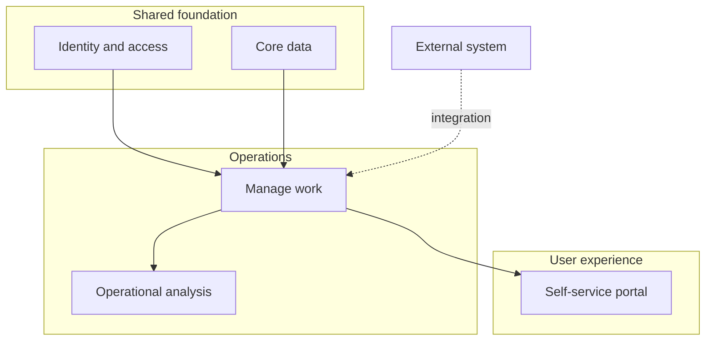

# Mermaid pattern

Use Mermaid when the structure is simple and should live alongside Markdown documentation.

Keep layers small. If a diagram needs many crossing lines, separate the capability map from the system relationship diagram.
